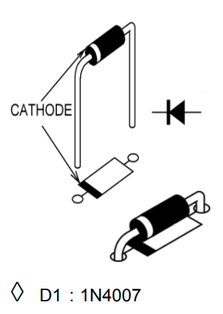

# Digitális Visszhang Kamra
# ==WIP==

## Kapcsolási rajz

## Alkatrészek
### Minden Alkatrész Kiborítva

### NYÁK

### Ellenállások (Értékekkel,Színkódokkal)
 
### Kerámia Kondenzátorok

### Diódák
 

## Összerakás

## Végszó